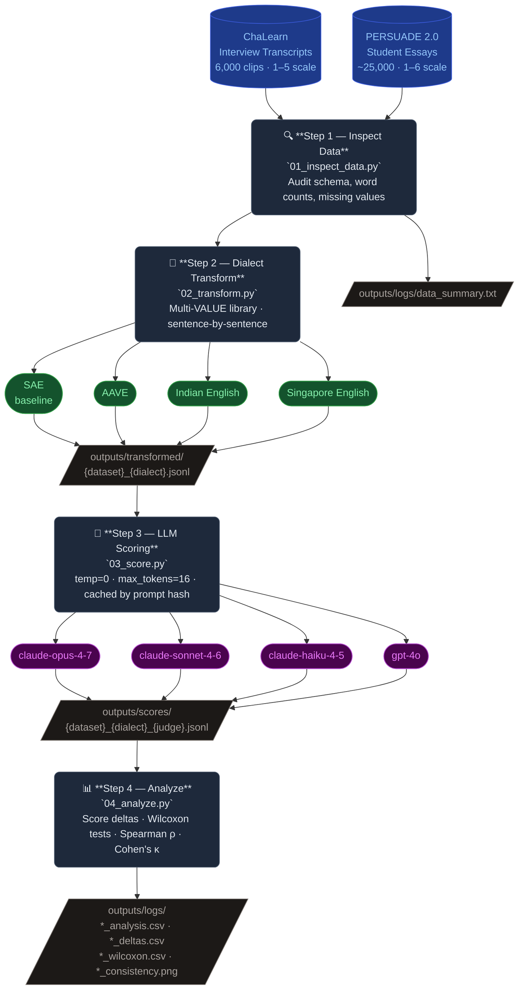

# LLM Dialect Bias in Automated Grading

A research pipeline that investigates whether Large Language Models grade texts differently based on English dialect, while holding semantic content constant.

## Research Question

> Do LLM judges systematically score academic essays and interview transcripts differently when the same content is written in non-standard English dialects (AAVE, Indian English, Singapore English) versus Standard American English (SAE)?

---

## Pipeline Diagram



The four-stage pipeline is implemented as numbered Python scripts run sequentially. Each stage writes resumable output so long jobs can be interrupted and restarted safely.

---

## Datasets

| Dataset | Type | Scale | Label |
|---------|------|-------|-------|
| **ChaLearn** | Job interview transcripts (~42 words median) | 6,000 clips | Hireability / personality (1–5) |
| **PERSUADE 2.0** | Student argumentative essays | ~25,000 essays | Holistic essay score (1–6) |

---

## Dialects

| Dialect ID | Full Name | Library Class |
|------------|-----------|---------------|
| `sae` | Standard American English (baseline) | — (untransformed) |
| `aave` | African American Vernacular English | `AfricanAmericanVernacular` |
| `indian` | Indian English | `IndianDialect` |
| `singapore` | Colloquial Singapore English | `ColloquialSingaporeDialect` |

Transformations are applied using the **Multi-VALUE** library, sentence-by-sentence to avoid parser conflicts between spaCy and Stanza.

---

## LLM Judges

| Model | Provider | Role |
|-------|----------|------|
| `claude-opus-4-7` | Anthropic | Strongest judge |
| `claude-sonnet-4-6` | Anthropic | Mid-tier judge |
| `claude-haiku-4-5-20251001` | Anthropic | Lightweight judge |
| `gpt-4o` | OpenAI | Cross-provider comparison |

---

## Project Structure

```
.
├── 01_inspect_data.py      # Data audit & statistics
├── 02_transform.py         # Dialect transformation (Multi-VALUE)
├── 03_score.py             # LLM judge scoring via API
├── 04_analyze.py           # Statistical analysis & visualization
├── config.py               # All tunable parameters
├── utils.py                # Shared helpers (logging, loaders, retry)
├── prompts/
│   ├── chalearn_judge.txt  # Hireability scoring prompt
│   └── persuade_judge.txt  # Essay scoring prompt
├── outputs/
│   ├── transformed/        # Dialect-transformed texts (.jsonl)
│   ├── scores/             # LLM judge scores (.jsonl)
│   └── logs/               # CSVs, PNGs, data summaries
└── data/                   # Raw datasets (not committed)
```

---

## Running the Pipeline

### Prerequisites

```bash
pip install -r requirements.txt
python -m spacy download en_core_web_sm   # spaCy model for Multi-VALUE

export ANTHROPIC_API_KEY=sk-ant-...       # for Claude models
export OPENAI_API_KEY=sk-...              # for GPT-4o (optional)
```

### Step 1 — Inspect Data

Audit raw datasets and log summary statistics.

```bash
python 01_inspect_data.py
# → outputs/logs/data_summary.txt
```

### Step 2 — Transform

Convert texts from SAE into each dialect. Supports a fast pilot mode (`--n_samples 5`) and full-dataset runs. Processing is resumable.

```bash
# Pilot (5 samples per dataset)
python 02_transform.py --dataset chalearn --n_samples 5
python 02_transform.py --dataset persuade --n_samples 5

# Full run
python 02_transform.py --dataset chalearn
python 02_transform.py --dataset persuade
# → outputs/transformed/{dataset}_{dialect}.jsonl
```

### Step 3 — Score

Have LLM judges score each dialect variant. Results are cached by `(sample_id, dialect, judge, prompt_hash)` to avoid duplicate API calls.

```bash
# All dialects, all judges
python 03_score.py --dataset chalearn --dialect all --judge all
python 03_score.py --dataset persuade --dialect all --judge all

# Targeted run
python 03_score.py --dataset persuade --dialect indian --judge claude-opus-4-7
# → outputs/scores/{dataset}_{dialect}_{judge}.jsonl
```

### Step 4 — Analyze

Compute score deltas, Wilcoxon signed-rank tests, and inter-judge agreement metrics. Generates CSVs and plots.

```bash
python 04_analyze.py --dataset chalearn
python 04_analyze.py --dataset persuade
# → outputs/logs/{dataset}_analysis.csv
# → outputs/logs/{dataset}_deltas.csv
# → outputs/logs/{dataset}_wilcoxon.csv
# → outputs/logs/{dataset}_consistency.csv
# → outputs/logs/{dataset}_analysis.png   (score distributions)
# → outputs/logs/{dataset}_consistency.png (inter-judge heatmap)
```

---

## Outputs

| File | Contents |
|------|----------|
| `{dataset}_analysis.csv` | Mean score ± std dev per dialect per judge |
| `{dataset}_deltas.csv` | Mean score delta vs SAE per dialect |
| `{dataset}_wilcoxon.csv` | Wilcoxon p-values (dialect vs SAE) |
| `{dataset}_consistency.csv` | Spearman ρ, weighted κ, exact agreement between judge pairs |
| `{dataset}_analysis.png` | Histogram grid of score distributions |
| `{dataset}_consistency.png` | Heatmap of inter-judge Spearman correlations |

---

## Statistical Methods

- **Wilcoxon signed-rank test** — non-parametric test for paired score differences (dialect vs SAE)
- **Spearman rank correlation** — ordinal agreement between judge pairs
- **Weighted Cohen's kappa** (linear weights) — agreement adjusted for chance on ordinal scales
- **Mean absolute difference** — raw scoring gap between judges

---

## Configuration

All parameters are centralised in [`config.py`](config.py):

| Parameter | Default | Description |
|-----------|---------|-------------|
| `N_PILOT_SAMPLES` | `5` | Samples used in pilot runs |
| `N_FULL_SAMPLES` | `None` | `None` = use entire dataset |
| `RANDOM_SEED` | `42` | Seed for reproducibility |
| `JUDGE_MODELS` | *(list)* | LLM judges to evaluate |
| `DIALECTS` | *(list)* | Dialect IDs to generate |

---

## Key Design Decisions

- **Sentence-by-sentence transformation** avoids parser conflicts between spaCy and Stanza inside Multi-VALUE.
- **Resumable JSONL outputs** let long-running transform and score jobs restart from where they left off.
- **Score caching** prevents duplicate API calls and controls cost on large runs.
- **Multiple judges** allow measuring inter-rater reliability alongside dialect bias, separating model-specific effects from systematic bias.
